# 📚 Research Notes: Email OTP & Asymmetric Encryption

## Table of Contents
- [Sending Emails with OTP](#-1-sending-emails-with-otp)
- [Asymmetric Encryption](#-2-asymmetric-encryption)

---

# 📧 1. Sending Emails with OTP

## Overview
Sending emails for signup verification and OTP (One-Time Password) is a common authentication pattern to verify user email addresses and secure account access.

---

## 🔧 Popular Email Services for Node.js

| Service | Description | Best For | Pricing |
|---------|-------------|----------|---------|
| **Nodemailer** | Most popular Node.js email library | SMTP, Gmail, custom servers | Free (open source) |
| **SendGrid** | Cloud-based email delivery | High-volume transactional emails | Free tier: 100 emails/day |
| **Mailgun** | Email API service | Developers who need API | Free tier: 5,000 emails/month |
| **AWS SES** | Amazon Simple Email Service | AWS ecosystem users | $0.10 per 1,000 emails |
| **Resend** | Modern email API | Simple integration, React Email | Free tier: 3,000 emails/month |

---

## 🚀 Implementation Steps

### Step 1: Choose Email Provider

**Option A: Nodemailer (Free, Self-hosted)**
```bash
npm install nodemailer
```

**Option B: SendGrid (Cloud Service)**
```bash
npm install @sendgrid/mail
```

**Option C: Resend (Modern, Simple)**
```bash
npm install resend
```

---

### Step 2: Setup Email Configuration

#### Using Nodemailer with Gmail

**Environment Variables:**
```env
EMAIL_HOST=smtp.gmail.com
EMAIL_PORT=587
EMAIL_USER=your-email@gmail.com
EMAIL_PASSWORD=your-app-specific-password
EMAIL_FROM=noreply@yourapp.com
```

> **⚠️ Important:** For Gmail, you need to use an [App Password](https://support.google.com/accounts/answer/185833), not your regular password.

**Email Service:**
```javascript
// src/common/services/email.service.js
import nodemailer from "nodemailer";
import { envVars } from "../../../config/index.js";

// Create reusable transporter
const transporter = nodemailer.createTransport({
  host: envVars.emailHost,
  port: envVars.emailPort,
  secure: false, // true for 465, false for other ports
  auth: {
    user: envVars.emailUser,
    pass: envVars.emailPassword,
  },
});

/**
 * Send email
 */
export const sendEmail = async ({ to, subject, html }) => {
  const mailOptions = {
    from: `"Your App" <${envVars.emailFrom}>`,
    to,
    subject,
    html,
  };

  return await transporter.sendMail(mailOptions);
};
```

---

### Step 3: Generate OTP

**OTP Utility:**
```javascript
// src/common/utils/otp.utils.js
import crypto from "crypto";

/**
 * Generate numeric OTP
 * @param {number} length - OTP length (default: 6)
 * @returns {string} - Random OTP
 */
export const generateOTP = (length = 6) => {
  const digits = "0123456789";
  let otp = "";
  
  for (let i = 0; i < length; i++) {
    const randomIndex = crypto.randomInt(0, digits.length);
    otp += digits[randomIndex];
  }
  
  return otp;
};

/**
 * Generate OTP with expiry
 * @param {number} expiryMinutes - Expiry time in minutes (default: 10)
 */
export const generateOTPWithExpiry = (expiryMinutes = 10) => {
  const otp = generateOTP();
  const expiresAt = new Date(Date.now() + expiryMinutes * 60 * 1000);
  
  return { otp, expiresAt };
};

/**
 * Verify OTP is not expired
 */
export const isOTPExpired = (expiresAt) => {
  return new Date() > new Date(expiresAt);
};
```

---

### Step 4: Update User Model

**Add OTP fields to User Schema:**
```javascript
const userSchema = new mongoose.Schema({
  // ... existing fields
  
  otp: {
    type: String,
  },
  otpExpiry: {
    type: Date,
  },
  isEmailVerified: {
    type: Boolean,
    default: false,
  },
  confirmEmail: Date,
});
```

---

### Step 5: Signup Flow with Email Verification


---

### Step 6: Implementation Code

**Signup Service:**
```javascript
// src/modules/user/user.service.js
import { generateOTPWithExpiry } from "../../common/utils/otp.utils.js";
import { sendEmail } from "../../common/services/email.service.js";

export const signup = async (inputs) => {
  // Check if user exists
  const checkUserExist = await dbRepository.findOne(UserModel, { 
    email: inputs.email 
  });
  if (checkUserExist) {
    throwError("email already exist", 409);
  }

  // Hash password
  const hashedPassword = await hashPassword(inputs.password);
  inputs.password = hashedPassword;

  // Generate OTP
  const { otp, expiresAt } = generateOTPWithExpiry(10); // 10 minutes
  inputs.otp = otp;
  inputs.otpExpiry = expiresAt;

  // Create user
  const user = await dbRepository.create(UserModel, inputs);

  // Send verification email
  await sendEmail({
    to: inputs.email,
    subject: "Verify Your Email - OTP Code",
    html: `
      <div style="font-family: Arial, sans-serif; padding: 20px;">
        <h2>Welcome to Saraha! 🎉</h2>
        <p>Your verification code is:</p>
        <h1 style="color: #4CAF50; font-size: 36px; letter-spacing: 5px;">
          ${otp}
        </h1>
        <p>This code will expire in 10 minutes.</p>
        <p>If you didn't request this, please ignore this email.</p>
      </div>
    `,
  });

  return user;
};

export const verifyEmail = async (inputs) => {
  const { email, otp } = inputs;

  // Find user
  const user = await dbRepository.findOne(UserModel, { email });
  if (!user) {
    throwError("User not found", 404);
  }

  // Check if already verified
  if (user.isEmailVerified) {
    throwError("Email already verified", 400);
  }

  // Verify OTP
  if (user.otp !== otp) {
    throwError("Invalid OTP", 401);
  }

  // Check expiry
  if (isOTPExpired(user.otpExpiry)) {
    throwError("OTP expired. Please request a new one", 401);
  }

  // Update user
  const updatedUser = await dbRepository.updateById(
    UserModel,
    user._id,
    {
      isEmailVerified: true,
      confirmEmail: new Date(),
      otp: null,
      otpExpiry: null,
    }
  );

  return updatedUser;
};
```

**Controller:**
```javascript
export const verifyEmailController = async (req, res, next) => {
  try {
    const user = await userService.verifyEmail(req.body);
    return successResponse({
      res,
      statusCode: 200,
      message: "Email verified successfully",
      data: user,
    });
  } catch (error) {
    next(error);
  }
};
```

**Route:**
```javascript
router.post("/verify-email", userController.verifyEmailController);
```

---

## 🎨 Professional Email Templates

### HTML Email Template with Styling

```html
<!DOCTYPE html>
<html>
<head>
  <style>
    body {
      font-family: Arial, sans-serif;
      background-color: #f4f4f4;
      margin: 0;
      padding: 0;
    }
    .container {
      max-width: 600px;
      margin: 0 auto;
      background-color: #ffffff;
      padding: 20px;
      border-radius: 10px;
      box-shadow: 0 4px 6px rgba(0,0,0,0.1);
    }
    .header {
      text-align: center;
      padding: 20px 0;
    }
    .otp-box {
      background: linear-gradient(135deg, #667eea 0%, #764ba2 100%);
      color: white;
      padding: 30px;
      text-align: center;
      border-radius: 10px;
      margin: 20px 0;
    }
    .otp-code {
      font-size: 48px;
      font-weight: bold;
      letter-spacing: 10px;
      margin: 20px 0;
    }
    .footer {
      text-align: center;
      color: #888;
      font-size: 12px;
      margin-top: 30px;
    }
  </style>
</head>
<body>
  <div class="container">
    <div class="header">
      <h1>🔐 Email Verification</h1>
    </div>
    <p>Hello,</p>
    <p>Thank you for signing up! Please use the code below to verify your email address:</p>
    
    <div class="otp-box">
      <p style="margin: 0; font-size: 14px;">Your verification code</p>
      <div class="otp-code">${otp}</div>
      <p style="margin: 0; font-size: 12px;">Valid for 10 minutes</p>
    </div>
    
    <p>If you didn't request this code, you can safely ignore this email.</p>
    
    <div class="footer">
      <p>© 2026 Saraha App. All rights reserved.</p>
    </div>
  </div>
</body>
</html>
```

---

## 🔄 Resend OTP Flow

```javascript
export const resendOTP = async (inputs) => {
  const { email } = inputs;

  const user = await dbRepository.findOne(UserModel, { email });
  if (!user) {
    throwError("User not found", 404);
  }

  if (user.isEmailVerified) {
    throwError("Email already verified", 400);
  }

  // Generate new OTP
  const { otp, expiresAt } = generateOTPWithExpiry(10);

  // Update user with new OTP
  await dbRepository.updateById(UserModel, user._id, {
    otp,
    otpExpiry: expiresAt,
  });

  // Send email
  await sendEmail({
    to: email,
    subject: "New OTP Code",
    html: `Your new verification code is: <strong>${otp}</strong>`,
  });

  return { message: "OTP sent successfully" };
};
```

---

## 📊 Email Service Comparison

```mermaid
graph TD
    A[Email Service Options] --> B[Nodemailer]
    A --> C[SendGrid]
    A --> D[Resend]
    A --> E[AWS SES]
    
    B --> B1[✅ Free]
    B --> B2[✅ Self-hosted]
    B --> B3[❌ Setup complexity]
    
    C --> C1[✅ Easy API]
    C --> C2[✅ Analytics]
    C --> C3[⚠️ Paid beyond 100/day]
    
    D --> D1[✅ Modern DX]
    D --> D2[✅ React Email]
    D --> D3[✅ 3000/month free]
    
    E --> E1[✅ Scalable]
    E --> E2[✅ AWS integration]
    E --> E3[⚠️ AWS setup needed]
    
    style B fill:#a8e6cf
    style C fill:#ffd3b6
    style D fill:#ffaaa5
    style E fill:#dda6ff
```



---

## 🔒 Security Best Practices

| Practice | Description | Why Important |
|----------|-------------|---------------|
| **OTP Expiry** | Set expiration (5-15 min) | Prevents replay attacks |
| **Rate Limiting** | Limit OTP requests per email | Prevents spam/abuse |
| **One-Time Use** | Delete OTP after verification | Ensures single use |
| **HTTPS Only** | Send OTP only over HTTPS | Prevents interception |
| **Secure Storage** | Hash OTP before storing (optional) | Extra security layer |
| **Account Lockout** | Lock after N failed attempts | Prevents brute force |

---

# 🔐 2. Asymmetric Encryption

## Overview
Asymmetric encryption uses a **pair of keys**: a **public key** for encryption and a **private key** for decryption. Unlike symmetric encryption (like AES), the encryption and decryption keys are different.

---

## 🔑 Key Concepts

```mermaid
graph LR
    A[Asymmetric Encryption] --> B[Public Key]
    A --> C[Private Key]
    
    B --> B1[🔓 Can be shared publicly]
    B --> B2[📤 Used to ENCRYPT data]
    B --> B3[✉️ Like a mailbox slot]
    
    C --> C1[🔒 Must be kept secret]
    C --> C2[📥 Used to DECRYPT data]
    C --> C3[🔑 Like a mailbox key]
    
    style B fill:#a8e6cf
    style C fill:#ffd3b6
```



---

## 🆚 Symmetric vs Asymmetric Encryption

| Feature | Symmetric | Asymmetric |
|---------|-----------|------------|
| **Keys** | Same key for encrypt/decrypt | Public key encrypts, private key decrypts |
| **Speed** | ⚡ Very fast | 🐌 Slower (computationally expensive) |
| **Key Distribution** | ❌ Difficult (must share secret) | ✅ Easy (public key can be shared) |
| **Use Case** | Large data encryption | Key exchange, digital signatures |
| **Algorithms** | AES, DES, 3DES | RSA, ECC, DSA |
| **Key Size** | 128-256 bits | 2048-4096 bits (RSA) |
| **Example** | Encrypting database fields | HTTPS/SSL, SSH, PGP email |

---

## 🎯 Common Use Cases

### 1. **HTTPS/SSL Certificates** 🌐
- Browser uses server's **public key** to encrypt data
- Server uses **private key** to decrypt
- Ensures secure web communication

### 2. **SSH Authentication** 💻
- Your **public key** is stored on server
- Your **private key** proves your identity
- Passwordless, secure login

### 3. **Digital Signatures** ✍️
- Sign data with **private key**
- Others verify with **public key**
- Proves authenticity and integrity

### 4. **Email Encryption (PGP)** 📧
- Encrypt email with recipient's **public key**
- Only recipient's **private key** can decrypt
- End-to-end email security

### 5. **Key Exchange** 🔄
- Exchange symmetric keys securely
- Used in TLS/SSL handshake
- Combines speed of symmetric with security of asymmetric

---

## 🔧 Popular Asymmetric Algorithms

| Algorithm | Key Size | Speed | Security | Best For |
|-----------|----------|-------|----------|----------|
| **RSA** | 2048-4096 bits | Slow | High | General purpose, widely supported |
| **ECC** | 256-384 bits | Fast | Very High | Mobile, IoT, modern apps |
| **DSA** | 1024-3072 bits | Medium | Medium | Digital signatures |
| **Ed25519** | 256 bits | Very Fast | Very High | SSH, modern crypto |

---

## 💻 Implementation in Node.js

### Using Node.js Crypto Module (RSA)

```javascript
import crypto from "crypto";

/**
 * Generate RSA key pair
 */
export const generateKeyPair = () => {
  const { publicKey, privateKey } = crypto.generateKeyPairSync("rsa", {
    modulusLength: 2048,
    publicKeyEncoding: {
      type: "spki",
      format: "pem",
    },
    privateKeyEncoding: {
      type: "pkcs8",
      format: "pem",
    },
  });

  return { publicKey, privateKey };
};

/**
 * Encrypt data with public key
 */
export const encryptWithPublicKey = (data, publicKey) => {
  const buffer = Buffer.from(data, "utf8");
  const encrypted = crypto.publicEncrypt(publicKey, buffer);
  return encrypted.toString("base64");
};

/**
 * Decrypt data with private key
 */
export const decryptWithPrivateKey = (encryptedData, privateKey) => {
  const buffer = Buffer.from(encryptedData, "base64");
  const decrypted = crypto.privateDecrypt(privateKey, buffer);
  return decrypted.toString("utf8");
};

/**
 * Sign data with private key
 */
export const signData = (data, privateKey) => {
  const sign = crypto.createSign("SHA256");
  sign.update(data);
  sign.end();
  return sign.sign(privateKey, "base64");
};

/**
 * Verify signature with public key
 */
export const verifySignature = (data, signature, publicKey) => {
  const verify = crypto.createVerify("SHA256");
  verify.update(data);
  verify.end();
  return verify.verify(publicKey, signature, "base64");
};
```

---

## 📋 Usage Example

```javascript
// Generate keys
const { publicKey, privateKey } = generateKeyPair();

// Encrypt
const message = "Hello, this is a secret message!";
const encrypted = encryptWithPublicKey(message, publicKey);
console.log("Encrypted:", encrypted);
// Output: Base64 encrypted string

// Decrypt
const decrypted = decryptWithPrivateKey(encrypted, privateKey);
console.log("Decrypted:", decrypted);
// Output: "Hello, this is a secret message!"

// Digital Signature
const data = "Important document";
const signature = signData(data, privateKey);
const isValid = verifySignature(data, signature, publicKey);
console.log("Signature valid:", isValid); // true
```

---

## 🔄 How RSA Works (Simplified)

```mermaid
sequenceDiagram
    participant A as Alice
    participant B as Bob
    
    Note over A,B: Key Generation
    B->>B: Generate key pair
    B->>A: Send public key 🔓
    
    Note over A,B: Encryption
    A->>A: Encrypt message with Bob's public key
    A->>B: Send encrypted message 📨
    
    Note over A,B: Decryption
    B->>B: Decrypt with private key 🔑
    B->>B: Read original message ✓
    
    Note over A: Only Bob can decrypt!<br/>Even Alice can't decrypt<br/>once encrypted
```



---

## 🛡️ RSA vs ECC Comparison

| Aspect | RSA | ECC |
|--------|-----|-----|
| **Key Size** | 2048 bits for 112-bit security | 256 bits for 128-bit security |
| **Performance** | Slower | 10x faster |
| **Battery Life** | Higher consumption | Lower consumption |
| **Adoption** | Widespread, legacy support | Modern, growing |
| **Best Use** | Web servers, email | Mobile, IoT, blockchain |

**Security Equivalence:**
- RSA 2048-bit ≈ ECC 224-bit
- RSA 3072-bit ≈ ECC 256-bit
- RSA 15360-bit ≈ ECC 512-bit

---

## 🎓 When to Use Asymmetric Encryption

### ✅ Use Asymmetric When:
- 🔐 Need to securely exchange keys
- ✍️ Digital signatures required
- 🌐 Public key infrastructure (PKI)
- 📧 Email encryption (PGP)
- 🔑 Authentication systems (SSH, JWT verification)

### ❌ Don't Use Asymmetric When:
- 💾 Encrypting large files (use symmetric instead)
- ⚡ Need high performance (use symmetric)
- 📦 Encrypting bulk data (combine: asymmetric for key, symmetric for data)

---

## 🔒 Hybrid Encryption (Best of Both Worlds)

Most real-world systems use **hybrid encryption**:


**Example: HTTPS/TLS**
1. RSA encrypts a random AES key
2. AES encrypts the actual website data
3. Fast + Secure! 🚀

---

## 📚 Summary

| Concept | Email OTP | Asymmetric Encryption |
|---------|-----------|----------------------|
| **Purpose** | Verify user identity | Secure key exchange, signatures |
| **Complexity** | Medium | High |
| **Libraries** | Nodemailer, SendGrid | Node.js crypto, OpenSSL |
| **Use in App** | Signup, 2FA | HTTPS, API security, JWT |
| **Security** | Time-limited codes | Public/private key pairs |

---

## 🎯 Next Steps

### For Email OTP:
1. ✅ Choose email provider (Nodemailer/SendGrid/Resend)
2. ✅ Setup SMTP or API credentials
3. ✅ Create email templates
4. ✅ Implement OTP generation and verification
5. ✅ Add rate limiting and security measures

### For Asymmetric Encryption:
1. ✅ Understand use case (signatures, key exchange, etc.)
2. ✅ Choose algorithm (RSA for general, ECC for modern)
3. ✅ Generate and store keys securely
4. ✅ Implement encryption/decryption functions
5. ✅ Consider hybrid approach for large data

---

## 🔗 Additional Resources

- [Nodemailer Documentation](https://nodemailer.com/)
- [SendGrid Node.js Guide](https://docs.sendgrid.com/for-developers/sending-email/nodejs)
- [Node.js Crypto Documentation](https://nodejs.org/api/crypto.html)
- [RSA Explained](https://www.youtube.com/watch?v=wXB-V_Keiu8)
- [Understanding HTTPS](https://howhttps.works/)
